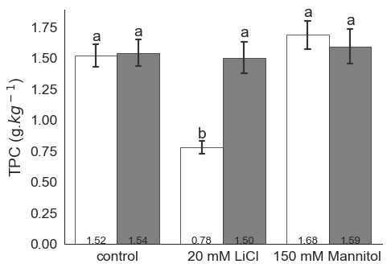
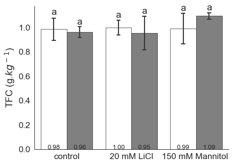
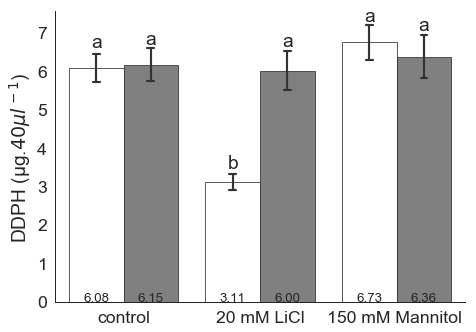
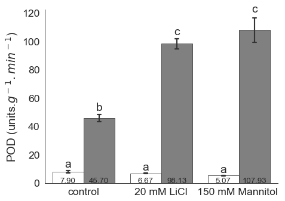
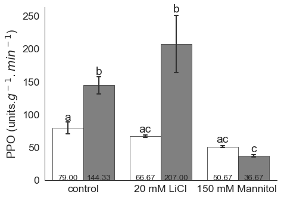

# Analysis of Potato biochem data
Jupyter lab 

date: 30 - 5 - 2020

Modules: pandas, scipy, numpy, researchpy, statsmodels, matplotlib, seaborn
##### Contact
Gordonw.wellman@kaust.edu.sa


```python
import pandas as pd
import scipy.stats as stats
import numpy as np
import researchpy as rp
import statsmodels.api as sm
from statsmodels.formula.api import ols
from statsmodels.stats.anova import anova_lm
import matplotlib.pyplot as plt 
import seaborn as sns

file = "data/Raw data Fig 1&2.xlsx"
sheet = "data"

df = pd.read_excel(open(file, 'rb'), sheet_name=sheet)  
df = df.drop(columns = ['Rep'])
df['Group'] = df['Treatment']+df['Var']
df
#print(df.columns)
#df.group
```


<div>
<style scoped>
    .dataframe tbody tr th:only-of-type {
        vertical-align: middle;
    }

    .dataframe tbody tr th {
        vertical-align: top;
    }

    .dataframe thead th {
        text-align: right;
    }
</style>
<table border="1" class="dataframe">
  <thead>
    <tr style="text-align: right;">
      <th></th>
      <th>Var</th>
      <th>Treatment</th>
      <th>TPC</th>
      <th>TF</th>
      <th>DDPH</th>
      <th>POD</th>
      <th>PPO</th>
      <th>Group</th>
    </tr>
  </thead>
  <tbody>
    <tr>
      <th>0</th>
      <td>Bari</td>
      <td>control</td>
      <td>1.575758</td>
      <td>0.965055</td>
      <td>6.303030</td>
      <td>8.1</td>
      <td>81.0</td>
      <td>controlBari</td>
    </tr>
    <tr>
      <th>1</th>
      <td>Bari</td>
      <td>control</td>
      <td>1.391919</td>
      <td>1.103516</td>
      <td>5.567677</td>
      <td>6.7</td>
      <td>67.0</td>
      <td>controlBari</td>
    </tr>
    <tr>
      <th>2</th>
      <td>Bari</td>
      <td>control</td>
      <td>1.589899</td>
      <td>0.883736</td>
      <td>6.359596</td>
      <td>8.9</td>
      <td>89.0</td>
      <td>controlBari</td>
    </tr>
    <tr>
      <th>3</th>
      <td>Bari</td>
      <td>20 mM LiCl</td>
      <td>0.705051</td>
      <td>0.987033</td>
      <td>2.820202</td>
      <td>6.6</td>
      <td>66.0</td>
      <td>20 mM LiClBari</td>
    </tr>
    <tr>
      <th>4</th>
      <td>Bari</td>
      <td>20 mM LiCl</td>
      <td>0.824242</td>
      <td>1.077143</td>
      <td>3.296970</td>
      <td>6.5</td>
      <td>65.0</td>
      <td>20 mM LiClBari</td>
    </tr>
    <tr>
      <th>5</th>
      <td>Bari</td>
      <td>20 mM LiCl</td>
      <td>0.806061</td>
      <td>0.932088</td>
      <td>3.224242</td>
      <td>6.9</td>
      <td>69.0</td>
      <td>20 mM LiClBari</td>
    </tr>
    <tr>
      <th>6</th>
      <td>Bari</td>
      <td>150 mM Mannitol</td>
      <td>1.755556</td>
      <td>0.901319</td>
      <td>7.022222</td>
      <td>4.9</td>
      <td>49.0</td>
      <td>150 mM Mannitol Bari</td>
    </tr>
    <tr>
      <th>7</th>
      <td>Bari</td>
      <td>150 mM Mannitol</td>
      <td>1.523232</td>
      <td>1.169451</td>
      <td>6.092929</td>
      <td>5.0</td>
      <td>50.0</td>
      <td>150 mM Mannitol Bari</td>
    </tr>
    <tr>
      <th>8</th>
      <td>Bari</td>
      <td>150 mM Mannitol</td>
      <td>1.771717</td>
      <td>0.903516</td>
      <td>7.086869</td>
      <td>5.3</td>
      <td>53.0</td>
      <td>150 mM Mannitol Bari</td>
    </tr>
    <tr>
      <th>9</th>
      <td>Spunta</td>
      <td>control</td>
      <td>1.676768</td>
      <td>0.956264</td>
      <td>6.707071</td>
      <td>42.5</td>
      <td>155.0</td>
      <td>controlSpunta</td>
    </tr>
    <tr>
      <th>10</th>
      <td>Spunta</td>
      <td>control</td>
      <td>1.523232</td>
      <td>1.017802</td>
      <td>6.092929</td>
      <td>45.5</td>
      <td>152.0</td>
      <td>controlSpunta</td>
    </tr>
    <tr>
      <th>11</th>
      <td>Spunta</td>
      <td>control</td>
      <td>1.414141</td>
      <td>0.907912</td>
      <td>5.656566</td>
      <td>49.1</td>
      <td>126.0</td>
      <td>controlSpunta</td>
    </tr>
    <tr>
      <th>12</th>
      <td>Spunta</td>
      <td>20 mM LiCl</td>
      <td>1.432323</td>
      <td>0.947473</td>
      <td>5.729293</td>
      <td>94.9</td>
      <td>256.0</td>
      <td>20 mM LiClSpunta</td>
    </tr>
    <tr>
      <th>13</th>
      <td>Spunta</td>
      <td>20 mM LiCl</td>
      <td>1.387879</td>
      <td>1.125495</td>
      <td>5.551515</td>
      <td>103.1</td>
      <td>215.0</td>
      <td>20 mM LiClSpunta</td>
    </tr>
    <tr>
      <th>14</th>
      <td>Spunta</td>
      <td>20 mM LiCl</td>
      <td>1.680808</td>
      <td>0.789231</td>
      <td>6.723232</td>
      <td>96.4</td>
      <td>150.0</td>
      <td>20 mM LiClSpunta</td>
    </tr>
    <tr>
      <th>15</th>
      <td>Spunta</td>
      <td>150 mM Mannitol</td>
      <td>1.404040</td>
      <td>1.081538</td>
      <td>5.616162</td>
      <td>112.2</td>
      <td>36.0</td>
      <td>150 mM Mannitol Spunta</td>
    </tr>
    <tr>
      <th>16</th>
      <td>Spunta</td>
      <td>150 mM Mannitol</td>
      <td>1.735354</td>
      <td>1.070549</td>
      <td>6.941414</td>
      <td>96.0</td>
      <td>35.0</td>
      <td>150 mM Mannitol Spunta</td>
    </tr>
    <tr>
      <th>17</th>
      <td>Spunta</td>
      <td>150 mM Mannitol</td>
      <td>1.632323</td>
      <td>1.129890</td>
      <td>6.529293</td>
      <td>115.6</td>
      <td>39.0</td>
      <td>150 mM Mannitol Spunta</td>
    </tr>
  </tbody>
</table>
</div>


```python
Vars = ["TPC", "TF","DDPH","POD","PPO"]
Var_titles = ['TPC (g.$kg^-$$^1$)','TFC (g.$kg^-$$^1$)','DDPH (μg.$40μl^-$$^1$)','POD (units.$g^-$$^1$$.min^-$$^1$)','PPO (units.$g^-$$^1$$.min^-$$^1$)']
print(Var_titles)
summary = rp.summary_cont(df.groupby(['Var','Treatment']))[Vars[0]]
summary
#error_bars = [summary.SD[2],summary.SD[1],summary.SD[0],summary.SD[5],summary.SD[4],summary.SD[3]]
#print(error_bars)
```

    ['TPC (g.$kg^-$$^1$)', 'TFC (g.$kg^-$$^1$)', 'DDPH (μg.$40μl^-$$^1$)', 'POD (units.$g^-$$^1$$.min^-$$^1$)', 'PPO (units.$g^-$$^1$$.min^-$$^1$)']
    
    
    


<div>
<style scoped>
    .dataframe tbody tr th:only-of-type {
        vertical-align: middle;
    }

    .dataframe tbody tr th {
        vertical-align: top;
    }

    .dataframe thead th {
        text-align: right;
    }
</style>
<table border="1" class="dataframe">
  <thead>
    <tr style="text-align: right;">
      <th></th>
      <th></th>
      <th>N</th>
      <th>Mean</th>
      <th>SD</th>
      <th>SE</th>
      <th>95% Conf.</th>
      <th>Interval</th>
    </tr>
    <tr>
      <th>Var</th>
      <th>Treatment</th>
      <th></th>
      <th></th>
      <th></th>
      <th></th>
      <th></th>
      <th></th>
    </tr>
  </thead>
  <tbody>
    <tr>
      <th rowspan="3" valign="top">Bari</th>
      <th>150 mM Mannitol</th>
      <td>3</td>
      <td>1.683502</td>
      <td>0.139032</td>
      <td>0.080270</td>
      <td>1.526172</td>
      <td>1.840832</td>
    </tr>
    <tr>
      <th>20 mM LiCl</th>
      <td>3</td>
      <td>0.778451</td>
      <td>0.064214</td>
      <td>0.037074</td>
      <td>0.705787</td>
      <td>0.851116</td>
    </tr>
    <tr>
      <th>control</th>
      <td>3</td>
      <td>1.519192</td>
      <td>0.110448</td>
      <td>0.063767</td>
      <td>1.394208</td>
      <td>1.644176</td>
    </tr>
    <tr>
      <th rowspan="3" valign="top">Spunta</th>
      <th>150 mM Mannitol</th>
      <td>3</td>
      <td>1.590572</td>
      <td>0.169557</td>
      <td>0.097894</td>
      <td>1.398701</td>
      <td>1.782444</td>
    </tr>
    <tr>
      <th>20 mM LiCl</th>
      <td>3</td>
      <td>1.500337</td>
      <td>0.157865</td>
      <td>0.091143</td>
      <td>1.321696</td>
      <td>1.678977</td>
    </tr>
    <tr>
      <th>control</th>
      <td>3</td>
      <td>1.538047</td>
      <td>0.131938</td>
      <td>0.076175</td>
      <td>1.388745</td>
      <td>1.687350</td>
    </tr>
  </tbody>
</table>
</div>


```python
def show_values_on_bars(axs, h_v="v", space=0.4):
    def _show_on_single_plot(ax):
        if h_v == "v":
            for p in ax.patches:
                _x = p.get_x() + p.get_width() / 2
                _y = p.get_y() + p.get_height()
                value = round(float(p.get_height()),2)
                ax.text(_x, _y, value, ha="center") 
        elif h_v == "h":
            for p in ax.patches:
                _x = p.get_x() + p.get_width() + float(space)
                _y = p.get_y() + p.get_height()
                value = int(p.get_width())
                ax.text(_x, _y, value, ha="left")

    if isinstance(axs, np.ndarray):
        for idx, ax in np.ndenumerate(axs):
            _show_on_single_plot(ax)
    else:
        _show_on_single_plot(axs)

def show_txt_on_bars(axs, h_v="v", space=0, txt = []):
    def _show_on_single_plot(ax):
        if h_v == "v":
            for idx in range(0,len(ax.patches)):
                p = ax.patches[idx]                
                txt_val = txt[idx]                                                                          
                _x = p.get_x() + p.get_width() / 2
                _y = p.get_y() + p.get_height() + txt_val[1]
                ax.text(_x, _y, txt_val[0], ha="center") 
    if isinstance(axs, np.ndarray):
        for idx, ax in np.ndenumerate(axs):
            _show_on_single_plot(ax)
    else:
        _show_on_single_plot(axs)
        
def show_values_on_bars_base(axs, h_v="v", space=0.004):
    def _show_on_single_plot_base(ax):
        if h_v == "v":
            for p in ax.patches:
                _x = p.get_x() + p.get_width() / 2
                _y = p.get_y()
                value = round(float(p.get_height()),2)
                ax.text(_x, _y, "%.2f" % round(value, 2), ha="center",fontsize='x-small') 
        elif h_v == "h":
            for p in ax.patches:
                _x = p.get_x() + p.get_width() + float(space)
                _y = p.get_y() + p.get_height()
                value = int(p.get_width())
                ax.text(_x, _y, value, ha="left",fontsize='smaller')

    if isinstance(axs, np.ndarray):
        for idx, ax in np.ndenumerate(axs):
            _show_on_single_plot_base(ax)
    else:
        _show_on_single_plot_base(axs)


        
# Draw a nested boxplot to show bills by day and time
Vars = ["TPC", "TF","DDPH","POD","PPO"]

def get_figure(var, txt = [],axis_titles = ["Treatment", "var"]):
    plt.clf()
    sns.set_style('white')
    sns.set_context('paper', font_scale=2)
    plt.figure(figsize=(7,5))
    ax = sns.barplot(x="Treatment", y=var,
                         hue="Var", ci="sd", palette=["white", "grey"], 
                         errcolor=".2", edgecolor=".2",
                         capsize=.05,
                         color = "white",
                         data=df)  
    
    sns.despine(offset=0, trim=False)                            
    ax.get_legend().remove()
    show_values_on_bars_base(ax, "v", 1.3)
    show_txt_on_bars(ax, "v", 1.3, txt)
    plt.xlabel(axis_titles[0])
    plt.ylabel(axis_titles[1])

    plt.tight_layout()
            
#for var in Vars:
#    txt = [("a",error_bars[0]),("b",error_bars[1]),("c",error_bars[2]),("d",error_bars[3]),("e",error_bars[4]),("f",error_bars[5])]    
#    get_figure(var, txt)
#    break
    #plt.savefig("figures/"+var+".png")                
    #plt.clf()
```

## ANOVA of Total Phenol Content


```python
plt.clf()
val = 0
# Create model
var = Vars[val]
var_title = Var_titles[val] 
summary = rp.summary_cont(df.groupby(['Var','Treatment']))[var]
print(summary)
print("Testing for: ",var)
formula = var+ ' ~ Var + Treatment + Var:Treatment'
model = sm.formula.ols(formula, data=df).fit()

# Perform ANOVA and print table
aov_table = sm.stats.anova_lm(model, typ=2)
print(aov_table)

# shapiro_test, p = shapiro(df[var])
# print('Shapiro-Test: Statistics=%.3f, p=%.3f' % (shapiro_test, p))
# alpha = 0.05
# if p > alpha:
#     print('Sample looks Gaussian (fail to reject H0)')
# else:
#     print('Sample does not look Gaussian (reject H0)')
# pyplot.hist(df[var])
# pyplot.show()
    
    
from statsmodels.stats.multicomp import pairwise_tukeyhsd
# perform multiple pairwise comparison (Tukey HSD)
m_comp = pairwise_tukeyhsd(endog=df[var], groups=df['Group'], alpha=0.05)

print(m_comp.summary())
```

    
    
                             N      Mean        SD        SE  95% Conf.  Interval
    Var    Treatment                                                             
    Bari   150 mM Mannitol   3  1.683502  0.139032  0.080270   1.526172  1.840832
           20 mM LiCl        3  0.778451  0.064214  0.037074   0.705787  0.851116
           control           3  1.519192  0.110448  0.063767   1.394208  1.644176
    Spunta 150 mM Mannitol   3  1.590572  0.169557  0.097894   1.398701  1.782444
           20 mM LiCl        3  1.500337  0.157865  0.091143   1.321696  1.678977
           control           3  1.538047  0.131938  0.076175   1.388745  1.687350
    Testing for:  TPC
                     sum_sq    df          F    PR(>F)
    Var            0.209830   1.0  11.795857  0.004944
    Treatment      0.821799   2.0  23.099254  0.000077
    Var:Treatment  0.585335   2.0  16.452693  0.000364
    Residual       0.213461  12.0        NaN       NaN
                  Multiple Comparison of Means - Tukey HSD,FWER=0.05             
    =============================================================================
            group1                 group2         meandiff  lower   upper  reject
    -----------------------------------------------------------------------------
     150 mM Mannitol Bari  150 mM Mannitol Spunta -0.0929  -0.4588  0.2729 False 
     150 mM Mannitol Bari      20 mM LiClBari     -0.9051  -1.2709 -0.5392  True 
     150 mM Mannitol Bari     20 mM LiClSpunta    -0.1832   -0.549  0.1827 False 
     150 mM Mannitol Bari       controlBari       -0.1643  -0.5302  0.2015 False 
     150 mM Mannitol Bari      controlSpunta      -0.1455  -0.5113  0.2204 False 
    150 mM Mannitol Spunta     20 mM LiClBari     -0.8121   -1.178 -0.4463  True 
    150 mM Mannitol Spunta    20 mM LiClSpunta    -0.0902  -0.4561  0.2756 False 
    150 mM Mannitol Spunta      controlBari       -0.0714  -0.4372  0.2945 False 
    150 mM Mannitol Spunta     controlSpunta      -0.0525  -0.4184  0.3133 False 
        20 mM LiClBari        20 mM LiClSpunta     0.7219   0.356   1.0877  True 
        20 mM LiClBari          controlBari        0.7407   0.3749  1.1066  True 
        20 mM LiClBari         controlSpunta       0.7596   0.3937  1.1254  True 
       20 mM LiClSpunta         controlBari        0.0189   -0.347  0.3847 False 
       20 mM LiClSpunta        controlSpunta       0.0377  -0.3281  0.4036 False 
         controlBari           controlSpunta       0.0189   -0.347  0.3847 False 
    -----------------------------------------------------------------------------
    


    <Figure size 432x288 with 0 Axes>


```python
letters = "abaaaa"
corrections = [0.01,0.01,0.01,0.01,0.01,0.01]
error_bars = [summary.SD[2],summary.SD[1],summary.SD[0],summary.SD[5],summary.SD[4],summary.SD[3]]
txt = [(letters[0],error_bars[0]+corrections[0]),(letters[1],error_bars[1]+corrections[1]),(letters[2],error_bars[2]+corrections[2]),(letters[3],error_bars[3]+corrections[3]),(letters[4],error_bars[4]+corrections[4]),(letters[5],error_bars[5]+corrections[5])]    
titles = ("",var_title)
get_figure(var,txt,titles)
plt.savefig("figures/"+var+".png")          
```


    <Figure size 432x288 with 0 Axes>





## ANOVA and Graph of Total Flavonoid Content


```python
plt.clf()
val = 1
# Create model
var = Vars[val]
var_title = Var_titles[val] 
summary = rp.summary_cont(df.groupby(['Var','Treatment']))[var]
print(summary)
print("Testing for: ",var)
formula = var+ ' ~ Var + Treatment + Var:Treatment'
model = sm.formula.ols(formula, data=df).fit()

# Perform ANOVA and print table
aov_table = sm.stats.anova_lm(model, typ=2)
print(aov_table)

# shapiro_test, p = shapiro(df[var])
# print('Shapiro-Test: Statistics=%.3f, p=%.3f' % (shapiro_test, p))
# alpha = 0.05
# if p > alpha:
#     print('Sample looks Gaussian (fail to reject H0)')
# else:
#     print('Sample does not look Gaussian (reject H0)')
# pyplot.hist(df[var])
# pyplot.show()
    
    
from statsmodels.stats.multicomp import pairwise_tukeyhsd
# perform multiple pairwise comparison (Tukey HSD)
m_comp = pairwise_tukeyhsd(endog=df[var], groups=df['Group'], alpha=0.05)

print(m_comp.summary())
```

    
    
                             N      Mean        SD        SE  95% Conf.  Interval
    Var    Treatment                                                             
    Bari   150 mM Mannitol   3  0.991429  0.154175  0.089013   0.816963  1.165895
           20 mM LiCl        3  0.998755  0.073234  0.042282   0.915882  1.081627
           control           3  0.984103  0.111121  0.064156   0.858357  1.109848
    Spunta 150 mM Mannitol   3  1.093993  0.031570  0.018227   1.058268  1.129717
           20 mM LiCl        3  0.954066  0.168229  0.097127   0.763697  1.144435
           control           3  0.960659  0.055077  0.031799   0.898334  1.022985
    Testing for:  TF
                     sum_sq    df         F    PR(>F)
    Var            0.000593   1.0  0.048186  0.829940
    Treatment      0.018716   2.0  0.760705  0.488602
    Var:Treatment  0.019006   2.0  0.772484  0.483526
    Residual       0.147625  12.0       NaN       NaN
                 Multiple Comparison of Means - Tukey HSD,FWER=0.05             
    ============================================================================
            group1                 group2         meandiff  lower  upper  reject
    ----------------------------------------------------------------------------
     150 mM Mannitol Bari  150 mM Mannitol Spunta  0.1026  -0.2017 0.4068 False 
     150 mM Mannitol Bari      20 mM LiClBari      0.0073  -0.2969 0.3116 False 
     150 mM Mannitol Bari     20 mM LiClSpunta    -0.0374  -0.3416 0.2669 False 
     150 mM Mannitol Bari       controlBari       -0.0073  -0.3116 0.2969 False 
     150 mM Mannitol Bari      controlSpunta      -0.0308   -0.335 0.2735 False 
    150 mM Mannitol Spunta     20 mM LiClBari     -0.0952  -0.3995 0.209  False 
    150 mM Mannitol Spunta    20 mM LiClSpunta    -0.1399  -0.4442 0.1643 False 
    150 mM Mannitol Spunta      controlBari       -0.1099  -0.4141 0.1944 False 
    150 mM Mannitol Spunta     controlSpunta      -0.1333  -0.4376 0.1709 False 
        20 mM LiClBari        20 mM LiClSpunta    -0.0447  -0.3489 0.2596 False 
        20 mM LiClBari          controlBari       -0.0147  -0.3189 0.2896 False 
        20 mM LiClBari         controlSpunta      -0.0381  -0.3423 0.2662 False 
       20 mM LiClSpunta         controlBari         0.03   -0.2742 0.3343 False 
       20 mM LiClSpunta        controlSpunta       0.0066  -0.2977 0.3108 False 
         controlBari           controlSpunta      -0.0234  -0.3277 0.2808 False 
    ----------------------------------------------------------------------------
    


    <Figure size 432x288 with 0 Axes>


```python
letters = "aaaaaa"
corrections = [0.01,0.01,-0.01,0.01,-0.01,0.015]
error_bars = [summary.SD[2],summary.SD[1],summary.SD[0],summary.SD[5],summary.SD[4],summary.SD[3]]
txt = [(letters[0],error_bars[0]+corrections[0]),(letters[1],error_bars[1]+corrections[1]),(letters[2],error_bars[2]+corrections[2]),(letters[3],error_bars[3]+corrections[3]),(letters[4],error_bars[4]+corrections[4]),(letters[5],error_bars[5]+corrections[5])]    
titles = ("",var_title)
get_figure(var,txt,titles)
plt.savefig("figures/"+var+".png")          
```


    <Figure size 432x288 with 0 Axes>





## ANOVA and Graph of DDPH


```python
plt.clf()
val = 2
# Create model
var = Vars[val]
var_title = Var_titles[val] 
summary = rp.summary_cont(df.groupby(['Var','Treatment']))[var]
print(summary)
print("Testing for: ",var)
formula = var+ ' ~ Var + Treatment + Var:Treatment'
model = sm.formula.ols(formula, data=df).fit()

# Perform ANOVA and print table
aov_table = sm.stats.anova_lm(model, typ=2)
print(aov_table)

# shapiro_test, p = shapiro(df[var])
# print('Shapiro-Test: Statistics=%.3f, p=%.3f' % (shapiro_test, p))
# alpha = 0.05
# if p > alpha:
#     print('Sample looks Gaussian (fail to reject H0)')
# else:
#     print('Sample does not look Gaussian (reject H0)')
# pyplot.hist(df[var])
# pyplot.show()
    
    
from statsmodels.stats.multicomp import pairwise_tukeyhsd
# perform multiple pairwise comparison (Tukey HSD)
m_comp = pairwise_tukeyhsd(endog=df[var], groups=df['Group'], alpha=0.05)

print(m_comp.summary())
```

    
    
                             N      Mean        SD        SE  95% Conf.  Interval
    Var    Treatment                                                             
    Bari   150 mM Mannitol   3  6.734007  0.556129  0.321082   6.104687  7.363326
           20 mM LiCl        3  3.113805  0.256854  0.148295   2.823147  3.404463
           control           3  6.076768  0.441792  0.255069   5.576833  6.576702
    Spunta 150 mM Mannitol   3  6.362290  0.678226  0.391574   5.594804  7.129775
           20 mM LiCl        3  6.001347  0.631459  0.364573   5.286784  6.715910
           control           3  6.152189  0.527754  0.304699   5.554979  6.749398
    Testing for:  DDPH
                      sum_sq    df          F    PR(>F)
    Var             3.357277   1.0  11.795857  0.004944
    Treatment      13.148786   2.0  23.099254  0.000077
    Var:Treatment   9.365365   2.0  16.452693  0.000364
    Residual        3.415379  12.0        NaN       NaN
                  Multiple Comparison of Means - Tukey HSD,FWER=0.05             
    =============================================================================
            group1                 group2         meandiff  lower   upper  reject
    -----------------------------------------------------------------------------
     150 mM Mannitol Bari  150 mM Mannitol Spunta -0.3717  -1.8351  1.0917 False 
     150 mM Mannitol Bari      20 mM LiClBari     -3.6202  -5.0836 -2.1568  True 
     150 mM Mannitol Bari     20 mM LiClSpunta    -0.7327  -2.1961  0.7307 False 
     150 mM Mannitol Bari       controlBari       -0.6572  -2.1206  0.8062 False 
     150 mM Mannitol Bari      controlSpunta      -0.5818  -2.0452  0.8816 False 
    150 mM Mannitol Spunta     20 mM LiClBari     -3.2485  -4.7119 -1.7851  True 
    150 mM Mannitol Spunta    20 mM LiClSpunta    -0.3609  -1.8244  1.1025 False 
    150 mM Mannitol Spunta      controlBari       -0.2855  -1.7489  1.1779 False 
    150 mM Mannitol Spunta     controlSpunta      -0.2101  -1.6735  1.2533 False 
        20 mM LiClBari        20 mM LiClSpunta     2.8875   1.4241  4.351   True 
        20 mM LiClBari          controlBari        2.963    1.4996  4.4264  True 
        20 mM LiClBari         controlSpunta       3.0384   1.575   4.5018  True 
       20 mM LiClSpunta         controlBari        0.0754   -1.388  1.5388 False 
       20 mM LiClSpunta        controlSpunta       0.1508  -1.3126  1.6143 False 
         controlBari           controlSpunta       0.0754   -1.388  1.5388 False 
    -----------------------------------------------------------------------------
    


    <Figure size 432x288 with 0 Axes>


```python
letters = "abaaaa"
corrections = [0.1,0.1,0.01,0.01,0.01,0.01]
error_bars = [summary.SD[2],summary.SD[1],summary.SD[0],summary.SD[5],summary.SD[4],summary.SD[3]]
txt = [(letters[0],error_bars[0]+corrections[0]),(letters[1],error_bars[1]+corrections[1]),(letters[2],error_bars[2]+corrections[2]),(letters[3],error_bars[3]+corrections[3]),(letters[4],error_bars[4]+corrections[4]),(letters[5],error_bars[5]+corrections[5])]    
titles = ("",var_title)
get_figure(var,txt,titles)
plt.savefig("figures/"+var+".png")  
```


    <Figure size 432x288 with 0 Axes>





```python
## ANOVA and Graph of PPO
```


```python
plt.clf()
val = 3
# Create model
var = Vars[val]
var_title = Var_titles[val] 
summary = rp.summary_cont(df.groupby(['Var','Treatment']))[var]
print(summary)
print("Testing for: ",var)
formula = var+ ' ~ Var + Treatment + Var:Treatment'
model = sm.formula.ols(formula, data=df).fit()

# Perform ANOVA and print table
aov_table = sm.stats.anova_lm(model, typ=2)
print(aov_table)

# shapiro_test, p = shapiro(df[var])
# print('Shapiro-Test: Statistics=%.3f, p=%.3f' % (shapiro_test, p))
# alpha = 0.05
# if p > alpha:
#     print('Sample looks Gaussian (fail to reject H0)')
# else:
#     print('Sample does not look Gaussian (reject H0)')
# pyplot.hist(df[var])
# pyplot.show()
    
    
from statsmodels.stats.multicomp import pairwise_tukeyhsd
# perform multiple pairwise comparison (Tukey HSD)
m_comp = pairwise_tukeyhsd(endog=df[var], groups=df['Group'], alpha=0.05)

print(m_comp.summary())
```

    
    
                             N        Mean         SD        SE  95% Conf.  \
    Var    Treatment                                                         
    Bari   150 mM Mannitol   3    5.066667   0.208167  0.120185   4.831104   
           20 mM LiCl        3    6.666667   0.208167  0.120185   6.431104   
           control           3    7.900000   1.113553  0.642910   6.639896   
    Spunta 150 mM Mannitol   3  107.933333  10.473459  6.046854  96.081499   
           20 mM LiCl        3   98.133333   4.366158  2.520802  93.192561   
           control           3   45.700000   3.304542  1.907878  41.960558   
    
                               Interval  
    Var    Treatment                     
    Bari   150 mM Mannitol     5.302229  
           20 mM LiCl          6.902229  
           control             9.160104  
    Spunta 150 mM Mannitol   119.785167  
           20 mM LiCl        103.074106  
           control            49.439442  
    Testing for:  POD
                         sum_sq    df            F        PR(>F)
    Var            26942.942222   1.0  1146.481076  2.798999e-13
    Treatment       3108.520000   2.0    66.137160  3.310955e-07
    Var:Treatment   3621.871111   2.0    77.059266  1.420951e-07
    Residual         282.006667  12.0          NaN           NaN
                    Multiple Comparison of Means - Tukey HSD,FWER=0.05               
    =================================================================================
            group1                 group2          meandiff   lower    upper   reject
    ---------------------------------------------------------------------------------
     150 mM Mannitol Bari  150 mM Mannitol Spunta  102.8667   89.569  116.1643  True 
     150 mM Mannitol Bari      20 mM LiClBari        1.6     -11.6977 14.8977  False 
     150 mM Mannitol Bari     20 mM LiClSpunta     93.0667    79.769  106.3643  True 
     150 mM Mannitol Bari       controlBari         2.8333   -10.4643  16.131  False 
     150 mM Mannitol Bari      controlSpunta       40.6333   27.3357   53.931   True 
    150 mM Mannitol Spunta     20 mM LiClBari     -101.2667 -114.5643 -87.969   True 
    150 mM Mannitol Spunta    20 mM LiClSpunta       -9.8    -23.0977  3.4977  False 
    150 mM Mannitol Spunta      controlBari       -100.0333  -113.331 -86.7357  True 
    150 mM Mannitol Spunta     controlSpunta       -62.2333  -75.531  -48.9357  True 
        20 mM LiClBari        20 mM LiClSpunta     91.4667    78.169  104.7643  True 
        20 mM LiClBari          controlBari         1.2333   -12.0643  14.531  False 
        20 mM LiClBari         controlSpunta       39.0333   25.7357   52.331   True 
       20 mM LiClSpunta         controlBari        -90.2333  -103.531 -76.9357  True 
       20 mM LiClSpunta        controlSpunta       -52.4333  -65.731  -39.1357  True 
         controlBari           controlSpunta         37.8    24.5023  51.0977   True 
    ---------------------------------------------------------------------------------
    


    <Figure size 432x288 with 0 Axes>


```python
letters = "aaabcc"
corrections = [2,2,2,2,2,2]
error_bars = [summary.SD[2],summary.SD[1],summary.SD[0],summary.SD[5],summary.SD[4],summary.SD[3]]
txt = [(letters[0],error_bars[0]+corrections[0]),(letters[1],error_bars[1]+corrections[1]),(letters[2],error_bars[2]+corrections[2]),(letters[3],error_bars[3]+corrections[3]),(letters[4],error_bars[4]+corrections[4]),(letters[5],error_bars[5]+corrections[5])]    
titles = ("",var_title)
get_figure(var,txt,titles)
plt.savefig("figures/"+var+".png")          
```


    <Figure size 432x288 with 0 Axes>





## ANOVA and Graph of PPO


```python
plt.clf()
val = 4
# Create model
var = Vars[val]
var_title = Var_titles[val] 
summary = rp.summary_cont(df.groupby(['Var','Treatment']))[var]
print(summary)
print("Testing for: ",var)
formula = var+ ' ~ Var + Treatment + Var:Treatment'
model = sm.formula.ols(formula, data=df).fit()

# Perform ANOVA and print table
aov_table = sm.stats.anova_lm(model, typ=2)
print(aov_table)

# shapiro_test, p = shapiro(df[var])
# print('Shapiro-Test: Statistics=%.3f, p=%.3f' % (shapiro_test, p))
# alpha = 0.05
# if p > alpha:
#     print('Sample looks Gaussian (fail to reject H0)')
# else:
#     print('Sample does not look Gaussian (reject H0)')
# pyplot.hist(df[var])
# pyplot.show()
    
    
from statsmodels.stats.multicomp import pairwise_tukeyhsd
# perform multiple pairwise comparison (Tukey HSD)
m_comp = pairwise_tukeyhsd(endog=df[var], groups=df['Group'], alpha=0.05)

print(m_comp.summary())
```

    
    
                             N        Mean         SD         SE   95% Conf.  \
    Var    Treatment                                                           
    Bari   150 mM Mannitol   3   50.666667   2.081666   1.201850   48.311040   
           20 mM LiCl        3   66.666667   2.081666   1.201850   64.311040   
           control           3   79.000000  11.135529   6.429101   66.398963   
    Spunta 150 mM Mannitol   3   36.666667   2.081666   1.201850   34.311040   
           20 mM LiCl        3  207.000000  53.450912  30.859898  146.514599   
           control           3  144.333333  15.947832   9.207485  126.286663   
    
                               Interval  
    Var    Treatment                     
    Bari   150 mM Mannitol    53.022293  
           20 mM LiCl         69.022293  
           control            91.601037  
    Spunta 150 mM Mannitol    39.022293  
           20 mM LiCl        267.485401  
           control           162.380004  
    Testing for:  PPO
                         sum_sq    df          F    PR(>F)
    Var            18368.055556   1.0  33.927655  0.000082
    Treatment      27874.777778   2.0  25.743766  0.000046
    Var:Treatment  17868.777778   2.0  16.502719  0.000359
    Residual        6496.666667  12.0        NaN       NaN
                   Multiple Comparison of Means - Tukey HSD,FWER=0.05               
    ================================================================================
            group1                 group2         meandiff   lower    upper   reject
    --------------------------------------------------------------------------------
     150 mM Mannitol Bari  150 mM Mannitol Spunta  -14.0    -77.8251 49.8251  False 
     150 mM Mannitol Bari      20 mM LiClBari       16.0    -47.8251 79.8251  False 
     150 mM Mannitol Bari     20 mM LiClSpunta    156.3333  92.5082  220.1584  True 
     150 mM Mannitol Bari       controlBari       28.3333   -35.4918 92.1584  False 
     150 mM Mannitol Bari      controlSpunta      93.6667   29.8416  157.4918  True 
    150 mM Mannitol Spunta     20 mM LiClBari       30.0    -33.8251 93.8251  False 
    150 mM Mannitol Spunta    20 mM LiClSpunta    170.3333  106.5082 234.1584  True 
    150 mM Mannitol Spunta      controlBari       42.3333   -21.4918 106.1584 False 
    150 mM Mannitol Spunta     controlSpunta      107.6667  43.8416  171.4918  True 
        20 mM LiClBari        20 mM LiClSpunta    140.3333  76.5082  204.1584  True 
        20 mM LiClBari          controlBari       12.3333   -51.4918 76.1584  False 
        20 mM LiClBari         controlSpunta      77.6667   13.8416  141.4918  True 
       20 mM LiClSpunta         controlBari        -128.0  -191.8251 -64.1749  True 
       20 mM LiClSpunta        controlSpunta      -62.6667 -126.4918  1.1584  False 
         controlBari           controlSpunta      65.3333    1.5082  129.1584  True 
    --------------------------------------------------------------------------------
    


    <Figure size 432x288 with 0 Axes>


```python
letters = ["a","ac","ac","b","b","c"]
corrections = [1,4,4,0.01,-5,4]
error_bars = [summary.SD[2],summary.SD[1],summary.SD[0],summary.SD[5],summary.SD[4],summary.SD[3]]
txt = [(letters[0],error_bars[0]+corrections[0]),(letters[1],error_bars[1]+corrections[1]),(letters[2],error_bars[2]+corrections[2]),(letters[3],error_bars[3]+corrections[3]),(letters[4],error_bars[4]+corrections[4]),(letters[5],error_bars[5]+corrections[5])]    
titles = ("",var_title)
get_figure(var,txt,titles)
plt.savefig("figures/"+var+".png")     
```


    <Figure size 432x288 with 0 Axes>




